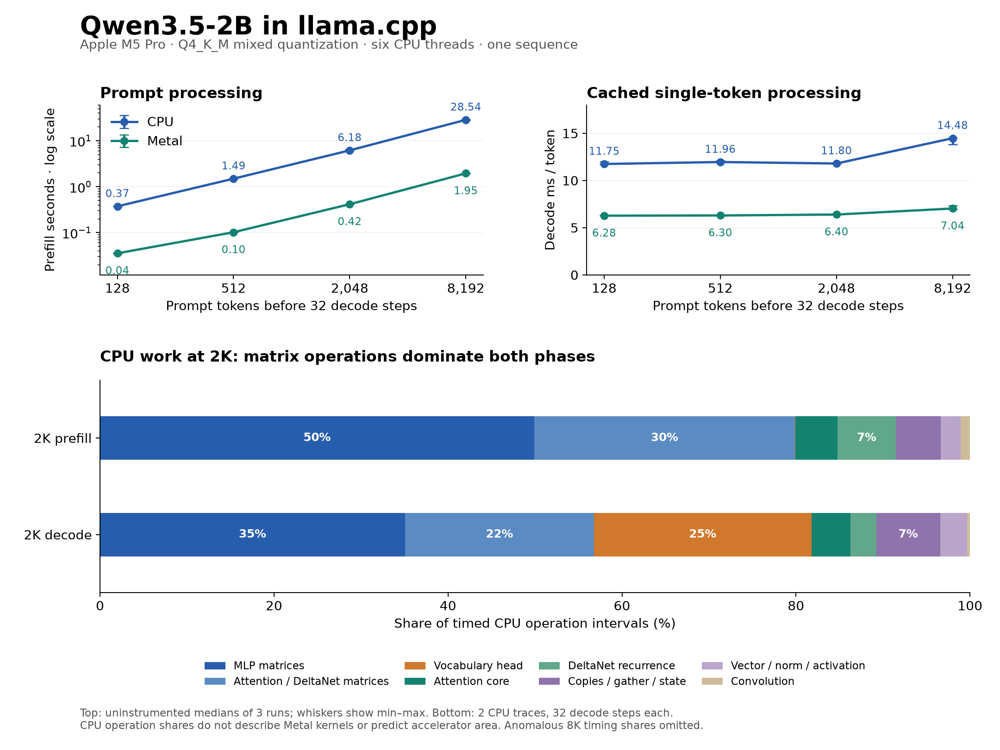

# Qwen3.5-2B: measured execution in llama.cpp

September 22, 2026. Local measurements on an Apple M5 Pro, 24 GiB unified memory. Six CPU threads; one sequence; Q4_K_M GGUF. These results inform the SiliconBadgers compute-block investigation.

**The first useful architectural result is that matrix operations dominate this optimized CPU implementation: about 80% of timed work during 2K prefill and 82% during decode. The vocabulary output head alone consumes about 25% of decode.** A shared arithmetic design serving MLP, attention/DeltaNet projections and the output head deserves direct comparison against separate engines. The measured CPU convolution share is small, so the earlier PyTorch convolution hotspot is not a sound basis for allocating accelerator resources.

This is evidence for which alternatives to investigate. CPU time does not determine accelerator area, memory bandwidth, energy or the final split between compute teams.

## What actually ran

- [llama.cpp source](https://github.com/ggml-org/llama.cpp/tree/f46bc30cb6a7f68a67e34a00061e20a4ad1eff43), commit `f46bc30cb6a7f68a67e34a00061e20a4ad1eff43`, Release/native CPU build with Metal available.
- [Unsloth Qwen3.5-2B GGUF](https://huggingface.co/unsloth/Qwen3.5-2B-GGUF/tree/f6d5376be1edb4d416d56da11e5397a961aca8ae), revision `f6d5376be1edb4d416d56da11e5397a961aca8ae`, file `Qwen3.5-2B-Q4_K_M.gguf`. SHA256: `aaf42c8b7c3cab2bf3d69c355048d4a0ee9973d48f16c731c0520ee914699223`.
- The [C++ harness](profile.cpp) calls the real llama.cpp library. CPU runs offload zero layers and disable operation/KQV offloading; Metal runs offload all 25 layers including the output layer.
- A repeated technical passage supplies identical token IDs to each backend. Each case performs a full prompt followed by 32 teacher-forced, single-token continuations. Context/state persists through those 32 steps. This probes model processing, not sampled chat quality.
- Each context receives a full-prompt/eight-step warmup. State is cleared before each measured repetition. Three repetitions form each baseline. Model loading, tokenization, sampling and saved-output checks are outside the phase timers; execution synchronization is inside.
- Flash attention is enabled, with physical microbatches capped at 512 tokens (128 for the shortest case). The model has 24 text layers: 18 recurrent/DeltaNet and six full-attention layers.

The quantization is mixed: matrix weights include Q4_K, Q5_K, Q6_K and Q8_0; other tensors include F32. **This is not the proposed custom symmetric INT4/group-64 accelerator format.**

## Baseline performance

Prefill is the median full-prompt latency. Decode latency is the median of the three run means, each over 32 cached single-token steps; throughput is its reciprocal. Context grows from the stated prompt length during those steps.

| Prompt tokens | CPU prefill, s | CPU decode, ms/token | CPU tokens/s | Metal prefill, s | Metal decode, ms/token | Metal tokens/s |
| ---: | ---: | ---: | ---: | ---: | ---: | ---: |
| 128 | 0.374 | 11.75 | 85.1 | 0.0355 | 6.28 | 159.3 |
| 512 | 1.495 | 11.96 | 83.6 | 0.1020 | 6.30 | 158.8 |
| 2,048 | 6.176 | 11.80 | 84.7 | 0.4150 | 6.40 | 156.3 |
| 8,192 | 28.542 | 14.48 | 69.1 | 1.9489 | 7.04 | 142.1 |

At 8K, CPU prefill repetitions ranged from 27.78–28.77 seconds and decode means from 13.83–14.53 ms/token. Metal ranges were 1.940–1.950 seconds and 6.94–7.36 ms/token. All repetitions and shorter-context ranges are retained in [summary.json](results/summary.json).

An independent stock `llama-bench` CPU check at cached depth 512 measured 332.4 prompt tokens/s and 83.3 decode tokens/s, consistent with the API harness. Its random tokens and prompt-depth setup differ, so this is a throughput sanity check.

## Where the CPU time goes

The following shares aggregate **two instrumented 2K repetitions**, weighting by summed timed operation intervals. They cover the CPU implementation only. Fusion is preserved; each interval includes computation, memory service, synchronization and possible OS stalls. They do not isolate arithmetic time or measure DRAM traffic.

| Work | 2K prefill | 2K decode |
| --- | ---: | ---: |
| MLP projections | 49.9% | 35.1% |
| Attention/DeltaNet projections | 30.0% | 21.7% |
| Vocabulary output head | 0.05% | 25.0% |
| Full-attention QK / softmax / AV | 4.8% | 4.5% |
| DeltaNet recurrence | 6.7% | 2.9% |
| Copies / gather / state movement | 5.2% | 7.3% |
| Vector / normalization / activation / other | 2.2% | 3.1% |
| Convolution | 1.1% | 0.3% |

Rounding can prevent columns from summing to exactly 100%. Matrix operations total 79.9% of prefill and 81.8% of decode. Each decode trace contains 187 matrix multiplies, 18 DeltaNet recurrence operations, 18 convolutions and six full-attention operations across all 24 layers.

The head's low prefill share follows the workload: only the final prompt position needs vocabulary logits, while every decode step needs them. With a 248,320-token vocabulary and hidden width 2,048, that projection is substantial. Ignoring it would leave a major decode cost out of the hardware proposal.

The 128/512/2K traces show the full-attention core's decode share increasing from approximately 0.5% to 1.6% to 4.5%. The initial 8K trace was anomalously slow: timed CPU intervals summed to 52.25 ms/token against the 14.48 ms baseline, and matrix kernels slowed broadly. Its outputs and coverage passed checks, but **its timing shares are excluded from the conclusions and plot**. Raw evidence remains available for inspection. A subsequent control using the patched library with tracing disabled was also slow: 68.46 seconds prefill and 54.04 ms/decode token. Disabling trace output therefore did not restore baseline behavior. The cause remains unresolved; these later diagnostics are kept separate and do not replace the three-run baselines.

## Shapes and storage relevant to a compute split

The trace records weight types, tensor dimensions, operation names and logical byte sizes in [operator-shapes.json.gz](results/operator-shapes.json.gz). The table writes matrices as output rows by input columns; this reverses GGML's first two `ne` dimensions.

| Operation family | Example weight shape | Why it matters |
| --- | --- | --- |
| MLP gate/up | 6,144 × 2,048 | Two expansion projections per layer; many repeated tiles |
| MLP down | 2,048 × 6,144 | Reduction and accumulation with a different output shape |
| DeltaNet QKV | 6,144 × 2,048 | Shares matrix geometry with MLP expansion |
| DeltaNet gate/output projections | 2,048 × 2,048 | More reuse of the same matrix arithmetic |
| DeltaNet alpha/beta projections | 16 × 2,048 | Small outputs can underutilize a large array |
| Full-attention Q / K,V | 4,096 × 2,048 / 512 × 2,048 | Unequal projection sizes and downstream cache dependencies |
| Vocabulary head | 248,320 × 2,048 | Large streamed projection every decode step |

Dense linear operations account for **1.8813 billion MACs per decode token**: 905.97 million in the MLP, 466.75 million in attention/DeltaNet projections, and 508.56 million in the vocabulary head. This is shape-derived arithmetic, not a counter measurement, and excludes attention QK/AV products, recurrence, convolution and nonlinear work. One MAC is one multiplication plus accumulation; this report does not silently count it as one floating-point operation.

The 187 distinct matrix weights occupy 1,267,679,232 logical stored bytes in this GGUF, including 417,177,600 bytes for the Q6_K tied embedding/output weight. Those sizes are useful inputs to a memory model; they are **not measured bytes fetched from DRAM per token**. Views, repacking, caches and reuse affect physical traffic. Prefill also contains zero-row output-head nodes in earlier microbatches; only the final microbatch executes a nonempty head projection.

For the six full-attention layers, FP16 KV storage is 12 KiB per live token: 24 MiB at 2,048 tokens and 96 MiB at 8,192, before the continuation. The runtime allocates rounded capacities of 2,560 and 8,704 tokens, so logs show 30 and 102 MiB respectively. Recurrent/convolution state allocation is 19.27 MiB in both cases; it includes runtime state/history storage. These allocation figures should not be equated with the minimum hardware SRAM requirement.

## What this changes for the team

**Compute 1 can now compare arithmetic designs against actual shapes.** Investigate a shared tiled matrix engine with a decode matrix-vector mode. Include the output head, short alpha/beta projections, mixed precision/dequantization and accumulation. Compare utilization and memory demand in 512-token prefill tiles and one-token decode. Deliver candidate tile sizes, a cycle/data-reuse model and representative kernel results.

**Compute 2 can investigate the stateful operations at the same time.** Work from the six attention layers and 18 DeltaNet layers: state update order, QK/softmax/AV, gating, normalization, convolution and opportunities to fuse local operations. Compare a reusable vector/state datapath against dedicated attention and recurrence hardware. Identify which products can use shared matrix arithmetic and which require a distinct schedule or local storage. A small CPU percentage alone does not make a required function optional.

This is a division of investigation between the two teams. The final number of hardware engines remains an outcome. The existing diagram's GEMM, attention, DeltaNet and vector boxes describe functions; shared arithmetic plus separate local controllers is one plausible implementation to test, and separate engines are another.

**Memory Control can model the alternatives immediately:** weight delivery for matrix-vector decode, reuse across prefill tiles, output-head streaming, growing KV reads and recurrent-state locality. Report capacity, required bandwidth, bank/port demand and assumptions; measured bandwidth counters remain future work.

**Top-Level Control can define coarse execution and dependency contracts:** matrix jobs, stateful jobs, buffer ownership, transfer completion and layer/token sequencing, leaving tile sequencing to local controllers. Mark precision and tile-dependent fields provisional rather than waiting for a final compute design.

**Verification can use the pinned inputs and saved outputs now**, then add operation/state fixtures, intermediate-state checks and numerical error budgets. Full-precision quality and the proposed custom INT4 format still require validation. **Physical Design can compare the area/timing cost of candidate arithmetic widths, SRAM banking and ports now**, with explicit assumptions rather than waiting for final RTL.

**Software's next deliverable is to extend this baseline:** representative prompts, larger context/batch sweeps, task-quality checks across numerical formats, intermediate tensor/state traces, and candidate accelerator-kernel experiments. It should provide evidence that lets all teams revise their estimates, without making initial parallel work depend on completing every profile.

The maintained [team next-steps draft](../../../docs/profiling-next-steps.md) includes these measured starting points and parallel deliverables.

## Validation, limits and reproduction

- Instrumentation preserved saved CPU logits bit-for-bit at the end of prefill and the final decode step for all four context lengths: 248,320 values per checkpoint. This validates those checkpoints, not every intermediate value or all possible inputs.
- CPU and Metal outputs are finite and agree on the highest-scoring token at all eight saved checkpoints. Maximum absolute logit differences range from 0.54 to 0.79; top-ten overlap is nine or ten. They are not numerically identical, and this is not an accuracy/perplexity test.
- The 2K timed interval sums are close to baseline execution: 6.01–6.17 seconds prefill and 11.97–12.14 ms/decode token. JSON serialization occurs after graph computation but inside the enclosing API call, so instrumented outer-call latency is not used for baseline throughput.
- Single host, six CPU threads, one quantized model, one repeated passage, three baseline repetitions and 32 decode steps constrain generalization. The desktop was not isolated from OS/other workloads. No power, hardware-bandwidth or accelerator-cycle measurements were taken. CPU profiles do not decompose Metal performance.
- The earlier FP32/PyTorch experiment used a different format and execution path. Its hotspot and these timings are not a controlled framework-only speed comparison.

See [README.md](README.md) for commands and provenance, [CPU-PROFILER-METHODOLOGY.md](CPU-PROFILER-METHODOLOGY.md) for the instrumentation, [manifest.json](manifest.json) for configuration, [operation-summary.json](results/operation-summary.json) for raw aggregation, and [profile-output-validation.json](results/profile-output-validation.json) / [cpu-metal-logit-check.json](results/cpu-metal-logit-check.json) for validation. The authoritative source change is [sb-cpu-profile.patch](sb-cpu-profile.patch). The original measurement run changed no remote repository or Discord configuration; this package publishes its preserved evidence.
